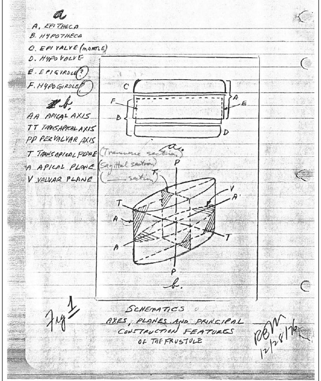
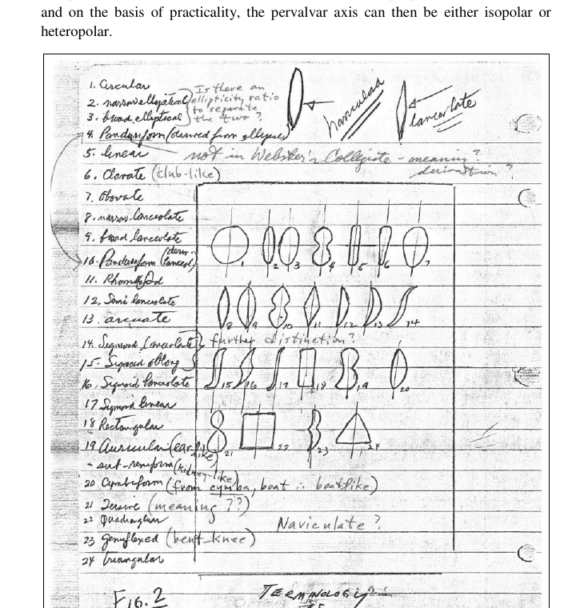
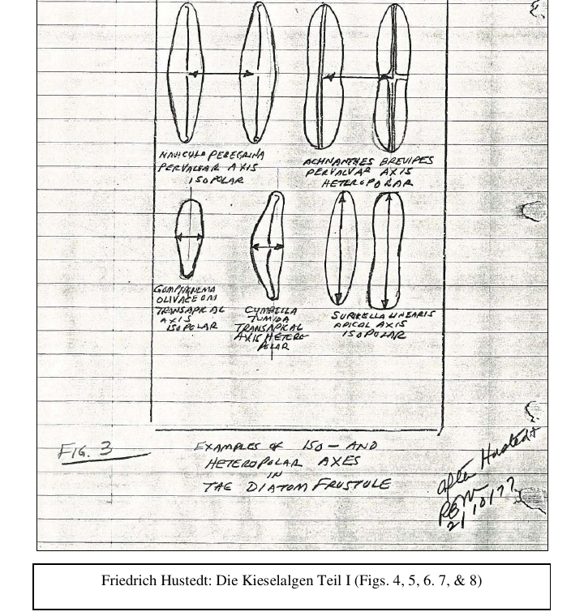
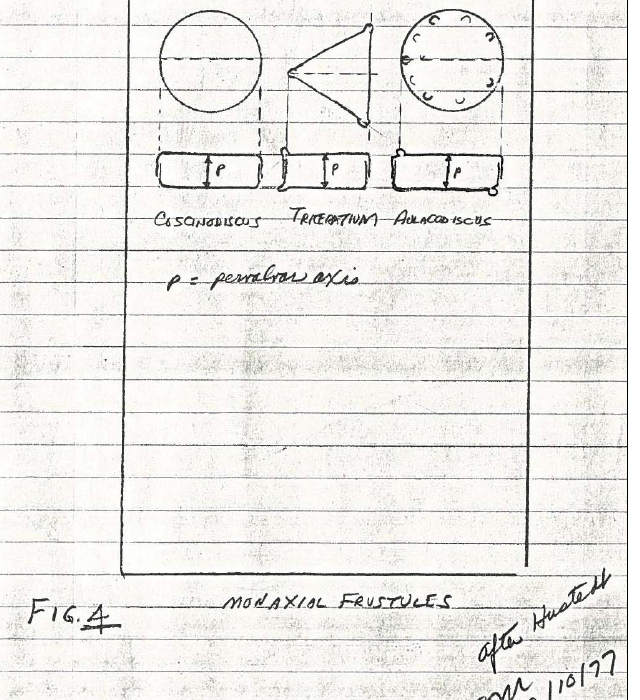
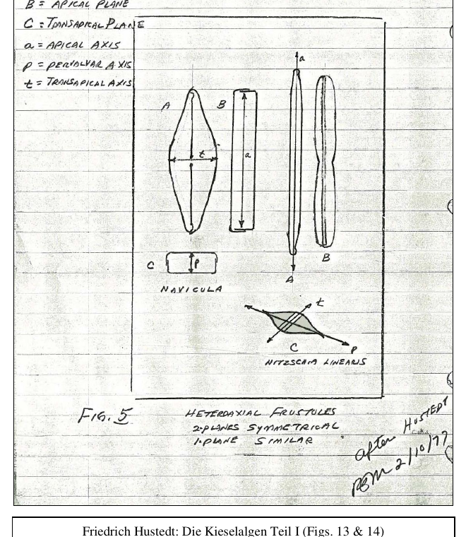

# Valor agregado - Storytelling diatomitas (resumen de PDFs)

Este resumen recopila ideas clave de los documentos en esta carpeta para
fortalecer la narrativa de origen y metodo. Incluye citas/parafrasis y
recortes de imagenes con utilidad visual.

## 1) 678.pdf - "Tecnica de las preparaciones microscopicas sistematicas" (Ernesto Caballero, 1925)
**Enfoque:** tecnicas para obtener, limpiar y montar diatomeas.

Puntos clave:
- Las diatomeas son algas microscopicas que viven libres o adheridas a plantas,
  piedras o conchas; aparecen en aguas dulces, salobres o marinas.
- Ademas de material reciente, existen depositos fosiles con diatomeas
  acumuladas a lo largo de siglos; pueden ser de agua dulce o marina.
- El objetivo del tratamiento es aislar valvas siliceas limpias, eliminando
  materia organica mediante medios quimicos sin atacar la silice.
- La recoleccion se adapta al terreno: desde capas flotantes hasta plantas
  acuaticas, usando herramientas simples (ganchos, cucharas, recipientes).
- Se recomienda evitar fermentacion si no se procesa de inmediato (uso de
  antisepticos como acido fenico en disolucion alcoholica).

Aplicacion narrativa:
- Conecta la historia con la tradicion cientifica: la diatomita se comprende
  como un material natural cuya pureza depende de procesos cuidadosos de
  seleccion, limpieza y conservacion.

## 2) cnwalter.pdf - "A Diatomist's Vade Mecum" (C.N. Walter)
**Enfoque:** guia practica para preparar y montar diatomeas al microscopio.

Puntos clave:
- La precision es central: limpieza de materiales, agua destilada y control de
  contaminacion en cada paso.
- El proceso incluye pre-lavado, seleccion bajo microscopio, secado y montaje
  controlado con adhesivos y resinas.
- Se usan filtros, solventes y montantes (ej. Canada Balsam, Styrax) para
  preservar y observar la estructura.

Aplicacion narrativa:
- Refuerza la idea de un material que se estudia con rigor y metodo, donde la
  microestructura se revela con cuidado artesanal.

## 3) practicaldirecti00edwa.pdf - "Practical Directions for Collecting..."
**Enfoque:** recoleccion y preparacion de diatomeas y depositos fosiles.

Puntos clave:
- Los depositos fosiles de diatomeas son extensos y se encuentran en capas
  ligeras, porosas y de tonos claros (blanco, crema, gris, fawn).
- La textura puede variar de arcillosa y friable a dura y porosa, pero siempre
  liviana; al microscopio se observan caparazones de diatomeas.
- Recomienda recolectar muestras de distintas profundidades para comprender la
  variacion del material.

Aplicacion narrativa:
- Permite hablar de la diatomita como un mineral ligero y poroso que se forma
  en grandes depositos naturales, con historia geologica.

## 4) rbm_US_Royal.pdf - "An Introduction to the Microscopical Study of Diatoms" (R.B. McLaughlin)
**Enfoque:** estructura de la pared celular y usos industriales de la diatomita.

Puntos clave:
- La pared celular (frustulo) es silicea y tiene estructura de "caja": valva
  superior e inferior con bandas de union (epivalva, hipovalva, cingulo).
- La forma y simetria del frustulo es clave para la identificacion; existen
  distintas geometrías y ejes.
- La diatomita (diatomaceous earth) se distingue por su ligereza, porosidad,
  capacidad de absorber liquidos y ser insoluble en acidos.
- Usos industriales: filtracion (agua, cerveza, aceites), aislante termico y
  acustico, rellenos en pinturas y materiales.

Aplicacion narrativa:
- Conecta la microestructura con propiedades visibles: absorcion rapida y
  secado; refuerza la idea de un material tecnico y natural a la vez.

## Imagenes recortadas (figuras)
Estas figuras vienen de rbm_US_Royal.pdf y muestran la estructura y formas de
las diatomeas. Son utiles para explicar la base cientifica del producto.

### Frustulo: ejes y partes

*Esquema del frustulo: valvas, ejes y planos principales.*

### Formas y terminologia

*Formas basicas de diatomeas y notas de terminologia.*

### Ejes iso/heteropolares

*Ejemplos de ejes y simetria en frustulos.*

### Frustulos monaxiales

*Ejemplos de frustulos monaxiales.*

### Frustulos heteroaxiales

*Ejemplos de frustulos heteroaxiales.*

## Lineas de historia sugeridas
- "La diatomita nace de algas microscopicas cuyo caparazon siliceo forma, con el
  tiempo, depositos naturales ligeros y porosos."
- "Su microestructura se estudia con precision: limpiar, aislar y observar cada
  frustulo revela por que absorbe y libera humedad con tanta rapidez."
- "Esa porosidad natural explica su uso historico en filtracion y aislamiento,
  y hoy se traduce en confort cotidiano en el bano."
