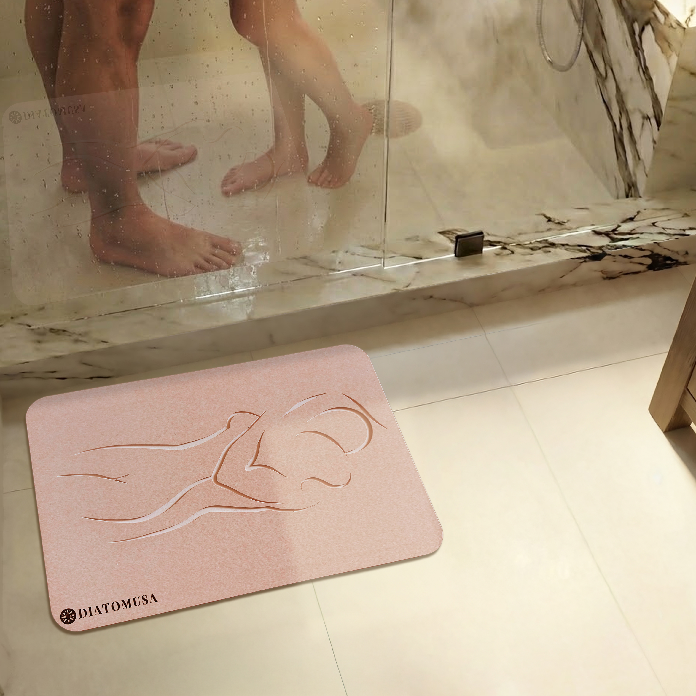
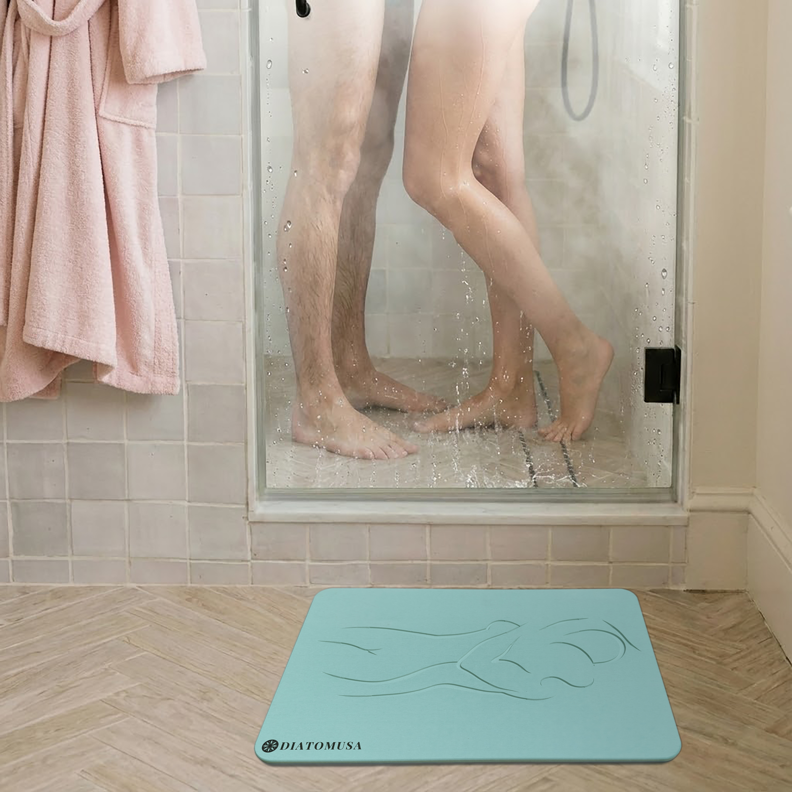
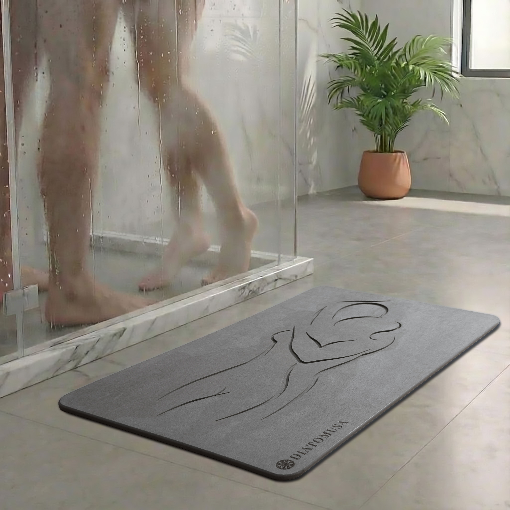
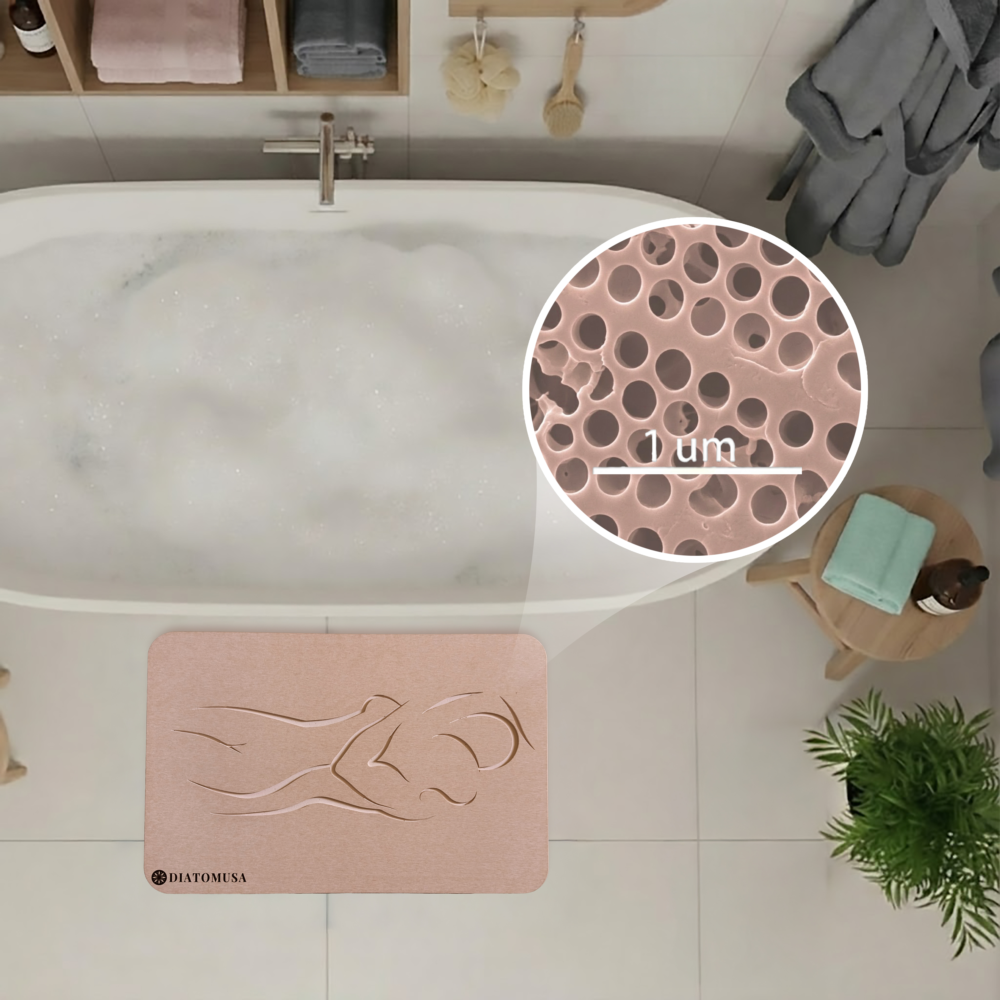
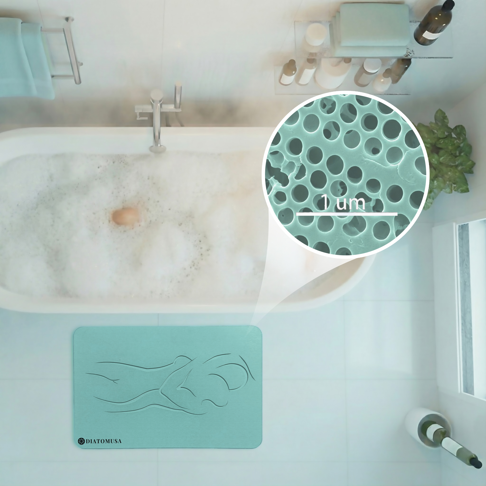
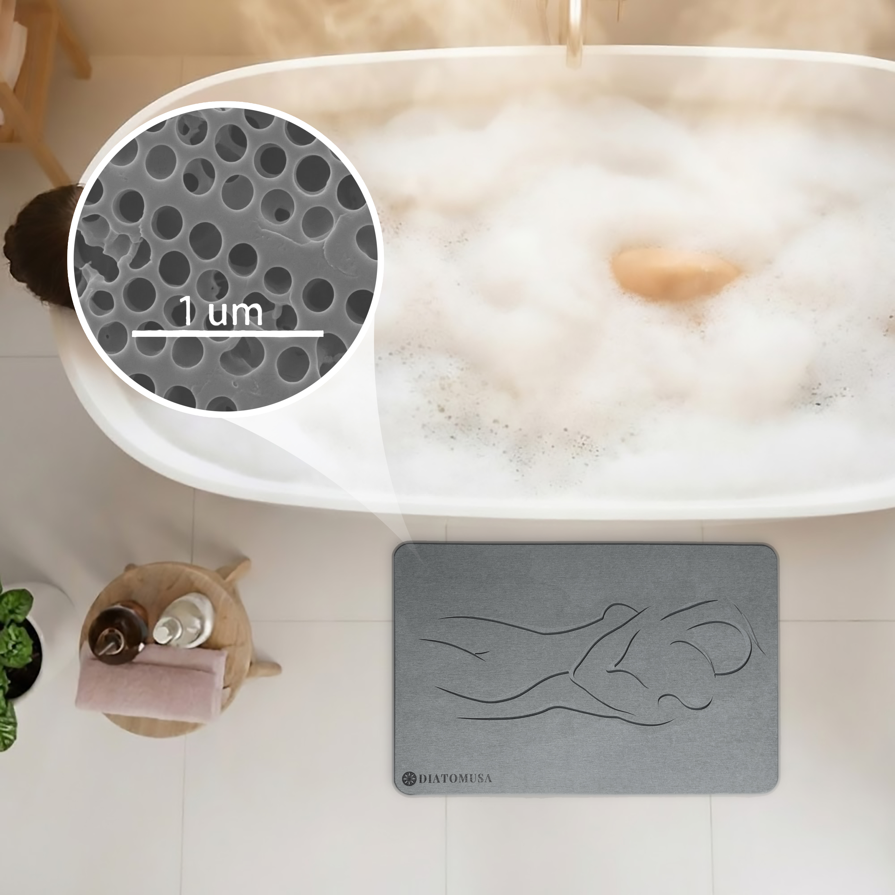
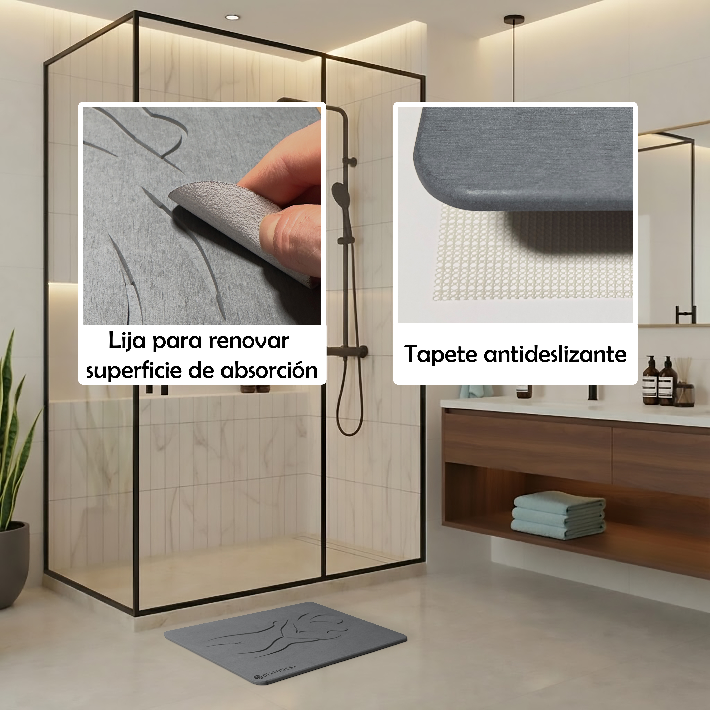

# DIATOMUSA - El Encuentro (Fotos finales)

Este set contiene fotos reales del producto y sus usos clave. Los archivos
estan renombrados en ASCII con la estructura:
`encuentro-{color}-{contexto}.jpg`.

## Descripciones con imagen y caption

### encuentro-rosa-packaging.jpg

*Alfombrilla rosa junto a la caja DIATOMUSA, disco de lijado y tapete antideslizante sobre fondo blanco.*

### encuentro-verde-packaging.jpg

*Alfombrilla verde con la caja DIATOMUSA al fondo, disco de lijado y tapete antideslizante sobre fondo blanco.*

### encuentro-gris-oscuro-packaging.jpg

*Alfombrilla gris oscuro con caja DIATOMUSA, disco de lijado y tapete antideslizante en un set limpio.*

### encuentro-rosa-ducha-uso.jpg

*Salida de ducha en bano de marmol: alfombrilla rosa en uso real con personas al fondo.*

### encuentro-verde-ducha-uso.jpg

*Bano luminoso con ducha y vapor: alfombrilla verde en el piso, escena cotidiana y serena.*

### encuentro-gris-oscuro-ducha-uso.jpg

*Bano moderno con mampara y planta: alfombrilla gris oscuro a la salida de la ducha.*

### encuentro-rosa-micro-poros.jpg

*Vista superior de tina con espuma: detalle de microporos (1 um) y alfombrilla rosa en el piso.*

### encuentro-verde-micro-poros.jpg

*Vista superior de tina con espuma: detalle de microporos (1 um) y alfombrilla verde en el piso.*

### encuentro-gris-oscuro-micro-poros.jpg

*Vista superior de tina con espuma: detalle de microporos (1 um) y alfombrilla gris oscuro.*

### encuentro-rosa-cuidado-lija-antideslizante.jpg

*Bano calido con llamados de cuidado: lijado para renovar absorcion y base antideslizante; alfombrilla rosa en uso.*

### encuentro-verde-cuidado-lija-antideslizante.jpg

*Bano luminoso con llamados de cuidado: lijado para renovar absorcion y base antideslizante; alfombrilla verde en piso.*

### encuentro-gris-oscuro-cuidado-lija-antideslizante.jpg

*Bano moderno con llamados de cuidado: lijado para renovar absorcion y base antideslizante; alfombrilla gris oscuro.*

### encuentro-rosa-secado-tiempo.jpg

*Secuencia de secado con tiempo marcado (0s a 8min) sobre alfombrilla rosa.*

### encuentro-verde-secado-tiempo.jpg

*Secuencia de secado con tiempo marcado (0s a 8min) sobre alfombrilla verde.*

### encuentro-gris-oscuro-secado-tiempo.jpg

*Secuencia de secado con tiempo marcado (0s a 8min) sobre alfombrilla gris oscuro.*

### encuentro-variantes-dimensiones-colores.jpg

*Comparativa de colores (rosa, gris oscuro, verde) con medidas 60 x 40 cm visibles.*
